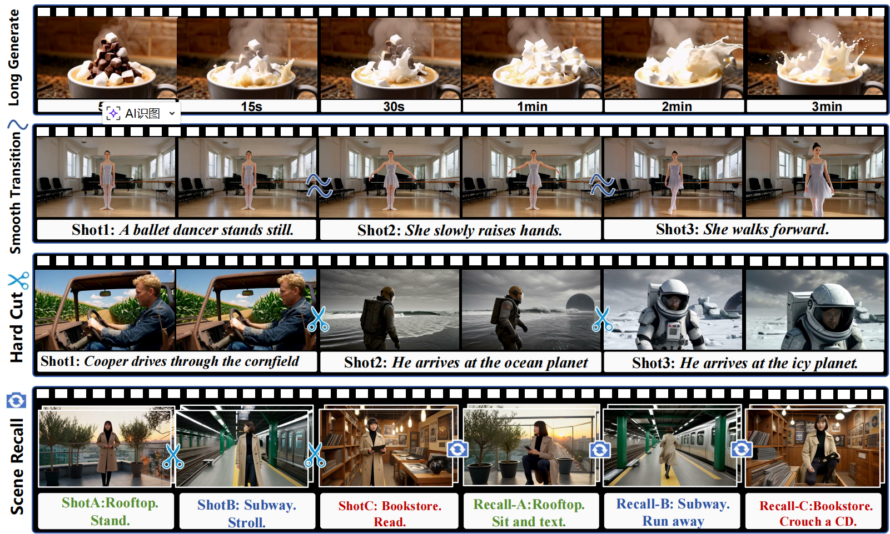
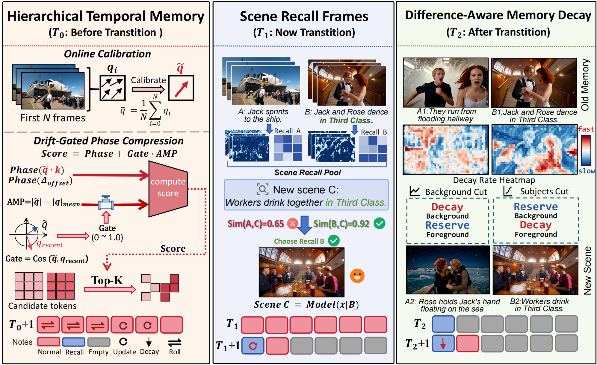
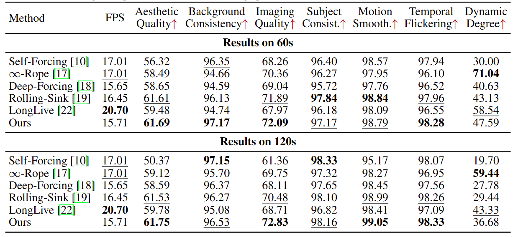
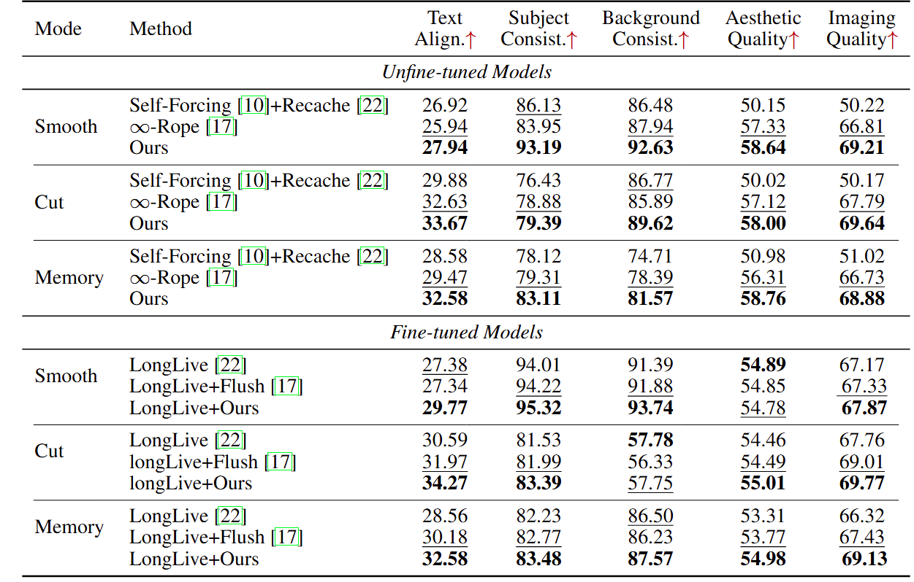

<<<<<<< HEAD
<<<<<<< HEAD
<h1 align="center">🎬 Echo-Forcing: A Scene Memory Framework for Interactive Long Video Generation</h1>
=======
=======
>>>>>>> 1e33823e22886da2f6dcf538c692b197ff2a60cf
<h1 align="center">🎥 Echo-Forcing:A Scene Memory Framework for Interactive Long Video Generation</h1>
<p align="center"><sub><b></b></sub></p>
>>>>>>> 1e33823e22886da2f6dcf538c692b197ff2a60cf

<p align="center">
  <a href="https://arxiv.org/html/2605.16003v1">
    
  </a>
  <a href="https://github.com/mingqiangWu/Echo-Forcing">
    
  </a>
</p>

<div align="center">
  <strong>
    Mingqiang Wu<sup>1,2,*</sup> |
    Weilun Feng<sup>1,2,*</sup> |
    Zhefeng Zhang<sup>3</sup> |
    Chuanguang Yang<sup>1,&dagger;</sup>
  </strong>
  <br>
  <strong>
    Haotong Qin<sup>4</sup> |
    Yuqi Li<sup>5</sup> |
    Guoxin Fan<sup>1,2</sup> |
    Xiaokun Liu<sup>1,2</sup>
  </strong>
  <br>
  <strong>
    Zhulin An<sup>1,&dagger;</sup> |
    Libo Huang<sup>1</sup> |
    Yongjun Xu<sup>1</sup>
  </strong>
</div>

<p align="center">
  <sup>*</sup> Equal Contribution &nbsp;&nbsp;
  <sup>&dagger;</sup> Corresponding Authors
</p>

<p align="center">
  State Key Laboratory of AI Safety, Institute of Computing Technology, Chinese Academy of Sciences<br>
  University of Chinese Academy of Sciences<br>
  China University of Mining and Technology, Beijing<br>
  ETH Zurich<br>
  City College of New York, City University of New York
</p>

<p align="center">
  
</p>

<p align="center">
Echo-Forcing enables training-free interactive long-video generation with preserve, recall, and forget scene memories.
</p>

<<<<<<< HEAD
## 🎥 Visualization

<div align="center">

https://github.com/user-attachments/assets/91158ce5-7a18-4f0b-a420-97be84288f22

<p align="center">
  <strong>"Interstellar"</strong>: a demo video with a scene transition every 10 seconds, for a total of 6 transitions.
</p>

=======
## 🎬 Visualization
<div align="center">
<<<<<<< HEAD

 https://github.com/user-attachments/assets/91158ce5-7a18-4f0b-a420-97be84288f22

<p align="center">
  <strong>"Interstellar"</strong>: a demo video with a scene transition every 10 seconds, for a total of 6 transitions.
</p>

>>>>>>> 1e33823e22886da2f6dcf538c692b197ff2a60cf
=======
  
 https://github.com/user-attachments/assets/91158ce5-7a18-4f0b-a420-97be84288f22
 
<p align="center">
  <strong>"Interstellar"</strong>: a demo video with a scene transition every 10 seconds, for a total of 6 transitions.
</p>
  
>>>>>>> 1e33823e22886da2f6dcf538c692b197ff2a60cf
</div>

## 📰 News

- **[2026/05/13]** Paper released. Code coming soon.

## 📖 Abstract

Autoregressive video diffusion models enable open-ended generation through local attention and KV caching. However, existing training-free long-video optimization methods mainly focus on stable extension under a single prompt, making them difficult to handle interactive scenarios involving prompt switching, old-scene forgetting, and historical scene recall.

We identify the core bottleneck as the functional entanglement of historical KV states: stable anchors and recent dynamics are handled by the same cache policy, leading to outdated background contamination, delayed response to new prompts, and loss of long-range memory.

To address this issue, we propose **Echo-Forcing**, a training-free scene-memory framework specifically designed for interactive long-video generation. Echo-Forcing introduces three core mechanisms:

- **Hierarchical Temporal Memory**, which decouples stable anchors, compressed history, and recent windows under relative RoPE.
- **Scene Recall Frames**, which compress historical scenes into spatially structured KV representations for long-term recall.
- **Difference-aware Memory Decay**, which adaptively forgets conflicting tokens according to the discrepancy between old and new scenes.

With these designs, Echo-Forcing uniformly supports long-horizon generation, smooth transitions, hard cuts, and long-range scene recall under a bounded cache budget.

## 🔍 Method Overview

<p align="center">
<<<<<<< HEAD
<<<<<<< HEAD
  
=======
  
>>>>>>> 1e33823e22886da2f6dcf538c692b197ff2a60cf
=======
  
>>>>>>> 1e33823e22886da2f6dcf538c692b197ff2a60cf
</p>

<p align="center">
  <strong>Overview of the proposed Echo-Forcing framework.</strong>
  Our method integrates three scene-memory modules to preserve temporal continuity, recall historical scenes, and suppress conflicting memories during interactive long-video generation.
</p>

## 📊 Results

<p align="center">
<<<<<<< HEAD
<<<<<<< HEAD
  
=======
  
>>>>>>> 1e33823e22886da2f6dcf538c692b197ff2a60cf
=======
  
>>>>>>> 1e33823e22886da2f6dcf538c692b197ff2a60cf
</p>

<p align="center">
Long-video generation on VBench-Long. We compare Echo-Forcing with training-free long-video baselines at 60s and 120s. Echo-Forcing improves visual fidelity and temporal stability while maintaining competitive inference throughput.
</p>

<p align="center">
<<<<<<< HEAD
<<<<<<< HEAD
  
=======
  
>>>>>>> 1e33823e22886da2f6dcf538c692b197ff2a60cf
=======
  
>>>>>>> 1e33823e22886da2f6dcf538c692b197ff2a60cf
</p>

<p align="center">
Interactive video generation. We evaluate smooth transition, hard cut, and scene recall under both non-fine-tuned and fine-tuned settings. Echo-Forcing consistently improves prompt responsiveness and scene consistency across interaction modes.
</p>
## 🛠️ Installation

Create a conda environment and install dependencies:

```bash
conda create -n self_forcing python=3.10 -y
conda activate self_forcing
pip install -r requirements.txt
pip install flash-attn --no-build-isolation
python setup.py develop
```

## 🚀 Quick Start

### 📦 Download Checkpoints

Download the Wan2.1 base model and the Echo-Forcing checkpoint:

```bash
huggingface-cli download Wan-AI/Wan2.1-T2V-1.3B --local-dir-use-symlinks False --local-dir wan_models/Wan2.1-T2V-1.3B
huggingface-cli download gdhe17/Self-Forcing checkpoints/self_forcing_dmd.pt --local-dir .
```

After downloading, the checkpoint files should be placed as follows:

```text
wan_models/Wan2.1-T2V-1.3B/
checkpoints/self_forcing_dmd.pt
```

### 🎞️ Long Video Generation

The long-video demo follows the settings in `inference.sh`:

```bash
python inference.py \
    --config_path configs/self_forcing_dmd.yaml \
    --output_folder ./output/long_video_demo \
    --checkpoint_path checkpoints/self_forcing_dmd.pt \
    --data_path ./prompts/moviegenbench_128_refined.txt \
    --num_output_frames 672 \
    --use_ema \
    --save_with_index \
    --seed 0 \
    --start_idx 0 \
    --end_idx 1
```

### 🧩 Interactive Generation

Smooth transition:

```bash
python inference.py \
    --config_path configs/self_forcing_dmd.yaml \
    --checkpoint_path checkpoints/self_forcing_dmd.pt \
    --output_folder ./output/smooth_demo \
    --data_path ./prompts/prompts_smooth.txt \
    --use_ema \
    --save_with_index \
    --start_idx 0 \
    --end_idx 1
```

Hard cut:

```bash
python inference.py \
    --config_path configs/self_forcing_dmd.yaml \
    --checkpoint_path checkpoints/self_forcing_dmd.pt \
    --output_folder ./output/hard_demo \
    --data_path ./prompts/prompts_hard.txt \
    --use_ema \
    --save_with_index \
    --start_idx 0 \
    --end_idx 1
```

Scene-recall frame:

```bash
python inference.py \
    --config_path configs/self_forcing_dmd.yaml \
    --checkpoint_path checkpoints/self_forcing_dmd.pt \
    --output_folder ./output/recall_demo \
    --data_path ./prompts/prompts_recall.txt \
    --use_ema \
    --save_with_index \
    --start_idx 0 \
    --end_idx 1
```

## 📝 Prompt Format

Each line in a prompt file is one generation example. Long-video generation uses a plain prompt without a duration suffix:

```text
A stylish woman walks down a bustling Tokyo street filled with warm glowing neon and animated city signage. She wears a black leather jacket over a long red dress and black boots, carrying a black purse.
```

Interactive generation uses scene segments separated by `|`. Add a duration marker after each scene:

- Smooth transition: `[10s]`
- Hard cut: `[10s#]`
- Scene-recall frame: `[10s@]`

The examples below split two scenes into two lines for readability. In a prompt file, keep each complete example on one line.

Smooth-transition example with two scenes:

```text
Static shot, static camera. In a sunlit artist loft with tall industrial windows, a young woman studies an unfinished canvas beside the easel[10s] |
Static shot, static camera. In the same sunlit artist loft, the same woman begins to paint with smooth confident strokes while warm morning light falls across the room[10s]
```

Hard-cut example with two scenes:

```text
Static shot, static camera. Scene cut to the sunny, crowded Southampton docks with the massive black hull of the Titanic towering in the background. Jack Dawson sprints excitedly toward the gangway[10s#] |
Static shot, static camera. Scene cut to the ornate Grand Staircase under the glass dome. Jack Dawson stands at the bottom step and gently kisses Rose DeWitt Bukater's hand[10s#]
```

Scene-recall example with two scenes:

```text
Static shot, cinematic realism. On a windswept rooftop garden at sunset high above a dense modern city, a young East Asian woman stands facing the camera and tightens the belt of her coat[10s#] |
Static shot, cinematic realism. Back on the same windswept rooftop garden at sunset, the same woman crouches beside a planter and picks up a vibrating phone[10s@]
```

Optional subtitles can be appended after `;`, with one subtitle per scene separated by `|`:

```text
scene prompt[10s] | next scene prompt[10s]; First subtitle | Second subtitle
```

## 📧 Contact

For questions or suggestions, please open an issue or contact:

- Mingqiang Wu: wumingqiang25e@ict.ac.cn
- Weilun Feng: [fengweilun24s@ict.ac.cn](mailto:fengweilun24s@ict.ac.cn)
- Chuanguang Yang: [yangchuanguang@ict.ac.cn](mailto:yangchuanguang@ict.ac.cn)
- Zhulin An: [anzhulin@ict.ac.cn](mailto:anzhulin@ict.ac.cn)
